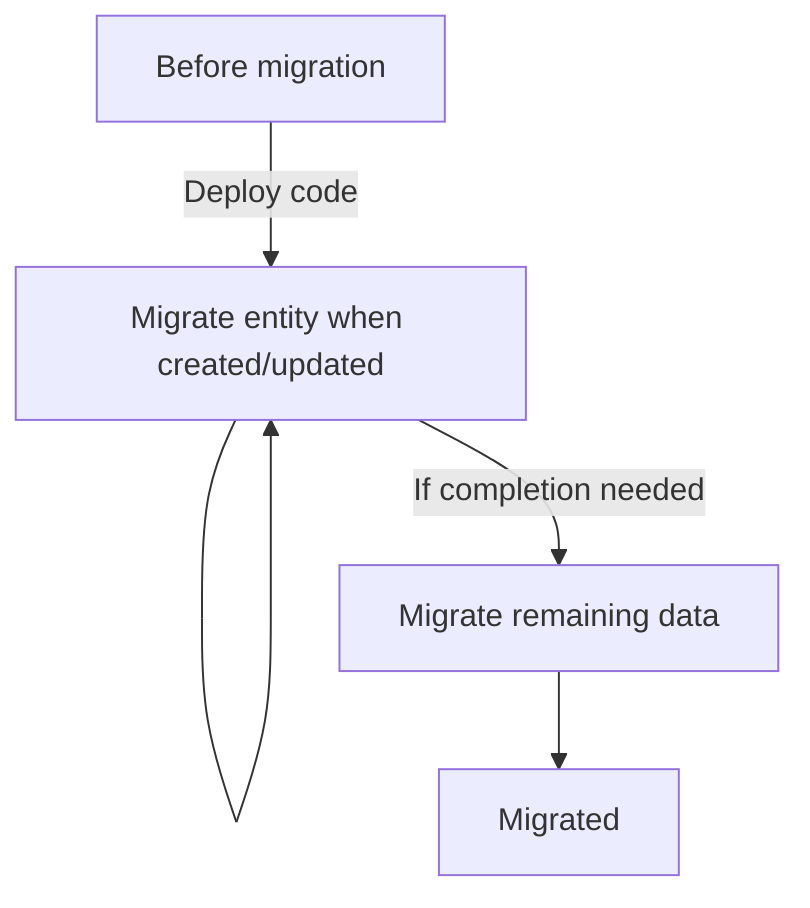
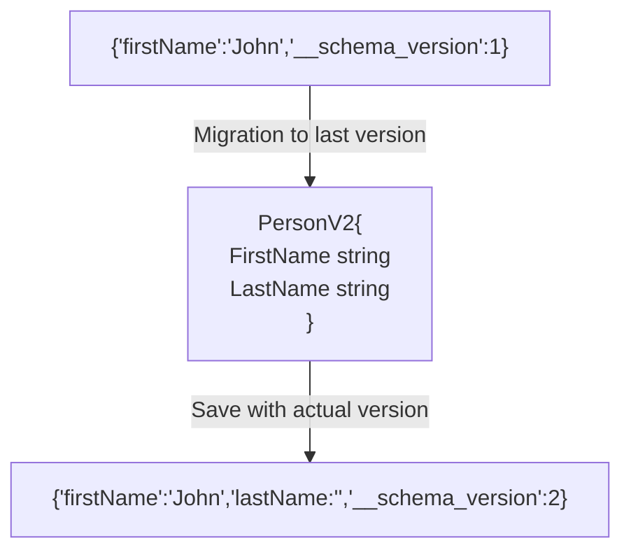

# Continuous-schema-migration

This is a golang library for on-the-fly/lazy migrations.

When doing migrations, it can be difficult to execute stop-the-world migrations
and migrate all the data at once. This is a library that shall enable the
migration when the data is retrieved/stored, and even a second time to convert
the remaining data:



Let's have an example with a migration for a Person entity from v1 to v2:

```golang
// From

PersonV1{
    FirstName string
}

// To

PersonV2{
    FirstName string
    LastName  string
}
```


If we take a look at a data which is updated from the database, show as
`Migrate entity when created/updated` in the previous diagram:



## Supported formats

* JSON

## Install the library

```bash
go get github.com/lerenn/continuous-schema-migration
```

## How-To

This how-to is based on the JSON version.

### Setting up the migrator

```golang
// Create a new migrator
mig := csm.NewMigratorJSON[EntityV3](migrations)
```

### Importing (and migrating) data from JSON

Here, the data is written but could come from a database.

```golang
// Importing an old object, do some modifications and save it as last version
data := []byte(`{"FullName":"John Robert Reddington","__schema_version":1}`)
migratedEntity, _ := mig.Import(data)
```

### Exporting the data to JSON with version

```golang
// Exporting the object with the version field
data, _ = mig.Export(migratedEntity)
```

Now the data can be saved in the database.

## Examples

* [JSON](./examples/json/json.go)
